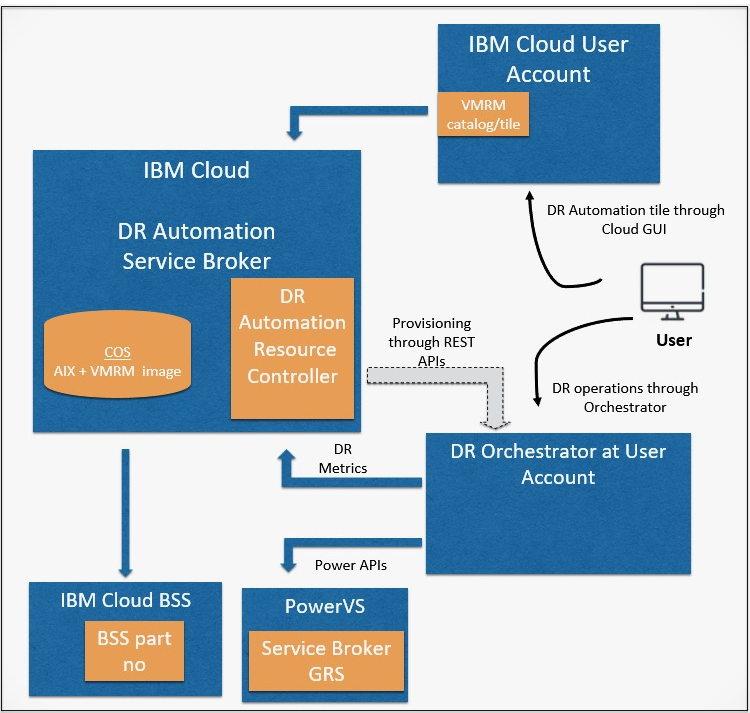

# Architecture for {{site.data.keyword.DR_full}}

{{site.data.keyword.DR_full}} is a robust disaster recovery solution specifically designed for IBM data centers, distinct from general IBM Cloud resources. This solution leverages dedicated network configurations and direct-attached storage to provide secure, reliable disaster recovery (DR) capabilities.

The IBM Cloud Service Framework facilitates seamless deployment and management of {{site.data.keyword.DR_full_notm}} by integrating key components such as the Service Broker, Resource Management Controller (RMC), and IBM Cloud Catalog. This framework streamlines the DR setup process, enhances security, and ensures compliance, delivering a comprehensive DR solution within the IBM Cloud infrastructure.

Explore the following sections to understand the {{site.data.keyword.DR_full_notm}} architecture, features, hardware requirements, and network configurations.

## Table of Contents

- [High-Level Architecture](#high-level-architecture)
- [Key Features](#key-features)
- [IBM Cloud Service Framework](#ibm-cloud-service-framework)
- [Hardware Specifications](#hardware-specifications)
- [Supported Storage Tiers](#supported-storage-tiers)
- [Network Configurations](#network-configurations)

---

## High-Level Architecture

The **{{site.data.keyword.DR_full_notm}}** system operates within IBM data centers, isolated from the core IBM Cloud environment. Utilizing dedicated networks and direct-attached storage ensures secure, high-performance disaster recovery (DR) capabilities tailored for fast, reliable workload recovery.

Central to this architecture is the **Service Broker**, which manages compute, storage, and network resources to streamline and automate DR processes. It simplifies recovery setup, enabling customers to quickly deploy and manage DR services through an intuitive interface.

The **Orchestrator (KSYS)** is crucial in coordinating DR workflows, ensuring Virtual Machines (VMs) are brought online in the correct order during recovery. This automation minimizes downtime and data loss, helping organizations confidently meet their Recovery Time Objectives (RTOs) and Recovery Point Objectives (RPOs).

This setup provides a secure, seamless DR solution that integrates with your production environment, enabling smooth failover and failback to maintain business continuity in case of unexpected events.

{: caption="DR Automation Architecture" caption-side="bottom"}

## DR Service Broker Architecture

The **DR Service Broker** within IBM Cloud is central to provisioning and managing DR orchestration for PowerVS. Operating as a dedicated component, it handles critical functions, including billing, resource management, and service orchestration.

### Service Provisioning

The Service Broker deploys the DR Orchestrator (KSYS) VM within the PowerVS workspace, utilizing PowerVS APIs to establish and manage DR operations. This process enables seamless integration of DR orchestration capabilities specific to each user account.

### Connectivity and Communication

Through IBM Cloud’s VPN and VPC services, the Service Broker communicates securely with the DR Orchestrator. Connections from external clients or users are routed through IBM’s secure networking layers to ensure high availability and low latency during DR operations.

### Resource Management and Billing Integration

The Service Broker updates DR metrics to IBM’s billing system (BSS) based on individual instances, providing granular billing data per customer. It ensures that usage is reported accurately for each instance and maintains a high level of automation in resource accounting.

### Interface Accessibility

The {{site.data.keyword.DR_short}} Service Broker, accessible via the IBM Cloud GUI, allows users to manage DR settings through a standardized interface. This design enhances user experience and aligns with IBM’s broader catalog for resource provisioning.

## DR Orchestrator (KSYS) Architecture

The **DR Orchestrator (KSYS)**, acting as the operational core within user accounts, is critical in executing and managing DR workflows, specifically for PowerVS instances. This component manages the deployment, configuration, and operation of VMs required during DR.

### VM Orchestration and Workflow Management

KSYS brings VMs online in the required sequence during a disaster, minimizing RTO and RPO. This workflow automation ensures systematic failover and recovery, essential for maintaining business continuity.

### Custom Metrics and Monitoring

KSYS regularly updates custom DR metrics, securely transmitting these to the Service Broker using IBM’s API services and adhering to authentication protocols. This allows ongoing monitoring and helps identify and address anomalies in real-time.

### Provisioning and Configuration Management

The Service Broker’s provisioning capabilities allow KSYS to be configured with essential user inputs and monitored to ensure alignment with the recovery environment. Additionally, it offers a GUI URL accessible through IBM’s catalog, enabling users to monitor and manage configurations in real-time.

### High Availability (Optional)

For enhanced resilience, KSYS supports a High Availability (HA) setup, ensuring continuous operation and reducing single points of failure.

{: caption="Connection between DR Service Broker and Orchestrator" caption-side="bottom"}

## Key Features

### Simplified Disaster Recovery Management

{{site.data.keyword.DR_short}} provides a single interface to manage DR processes for IBM PowerVS environments. Key features include:

- **Automated Failover and Failback**:
Automate the failover process, ensuring that workloads resume quickly in the backup environment.

- **Scheduling and Monitoring**:
Schedule DR operations and monitor the health and status of DR sites.

- **Customizable Recovery Settings**:
Define recovery priorities and configurations for different VMs or applications.

### Flexible Billing Model

{{site.data.keyword.DR_short}} follows a usage-based billing model, with flexible options based on the selected resources and configurations.
The IBM Cloud Service Framework supports accurate billing and comprehensive reporting, ensuring customers have clear visibility into DR-related costs.

---

## IBM Cloud Service Framework

The **IBM Cloud Service Framework** enhances {{site.data.keyword.DR_short}} by enabling seamless service deployment and management. Key components include:

- **Service Broker**: Manages compute, storage, and network resources, allowing users to select DR services from the IBM Cloud Catalog and configure deployment details.
This component plays a central role in streamlining and automating DR processes.

- **Resource Management Controller (RMC)**: Automates provisioning, image import, and VM configuration, making DR deployment efficient and straightforward for users.

- **Orchestrator (KSYS)**: Coordinates DR workflows and ensures that VMs recover in a defined sequence, minimizing downtime and data loss.

- **Security and Compliance**: Ensures a secure, compliant environment through robust controls and monitoring.
This includes IBM Cloud services like Activity Tracker (for monitoring) Cloud Object Storage (COS) (for secure storage), and Key Management (for data security).

- **Reliable Connectivity**: Maintains continuous, secure access to DR resources through redundant network connections, enhancing reliability and resilience.

This integrated framework provides a secure, compliant, and efficient DR solution that aligns closely with the high-level architecture for {{site.data.keyword.DR_short}} in IBM data centers.

---

## Hardware Specifications

IBM Power servers supported by {{site.data.keyword.DR_full_notm}} include:

- **IBM Power S922** (9009-22A)
- **IBM Power S922** (9009-22G)
- **IBM Power E980** (9080-M9S)
- **IBM Power E1080** (9080-HEX)

For more details, refer to the specific data sheets and hardware overview table.

---

## Supported Storage Tiers

{{site.data.keyword.DR_short}} offers storage with configurable IOPS levels to meet diverse DR requirements:

| Tier Level | IOPS       | Performance                                |
|------------|------------|--------------------------------------------|
| **Tier 0** | 25 IOPS/GB | High performance for critical workloads    |
| **Tier 1** | 10 IOPS/GB | Balanced performance for general workloads |
| **Tier 3** | 3 IOPS/GB  | Cost-effective for non-critical applications |
{: caption="Tier and IOPS mapping" caption-side="bottom"}

With the IBM Cloud Service Framework, storage is allocated based on deployment needs, ensuring efficient usage of resources and seamless management.

---

## Network Configurations

### Public Network

{{site.data.keyword.DR_short}} offers public network connectivity for seamless access and configuration.
IBM configures the network environment for secure public connections, including firewall protection and support for SSH, HTTPS, and IBM i terminal emulation.

### Private Network

A private network setup is recommended for secure communication between PowerVS instances in primary and DR sites. This configuration supports:

- **IBM Cloud Resources Access**:
Enable access to IBM Cloud Bare Metal Servers, Kubernetes containers, and Cloud Object Storage.

- **Direct Link Connect**:
Use Direct Link Connect for secure, low-latency communication between DR environments.

---

## Setting Up {{site.data.keyword.DR_short}}

1. **Create IBM Cloud Account**: Log in to your IBM Cloud account.
2. **Access {{site.data.keyword.DR_full_notm}} in IBM Catalog**: Locate the {{site.data.keyword.DR_full_notm}} tile.
3. **Configure Resources**: Set up storage, compute, and network resources according to DR needs.
4. **Monitor and Test**: Schedule DR tests and monitor system health.

--
