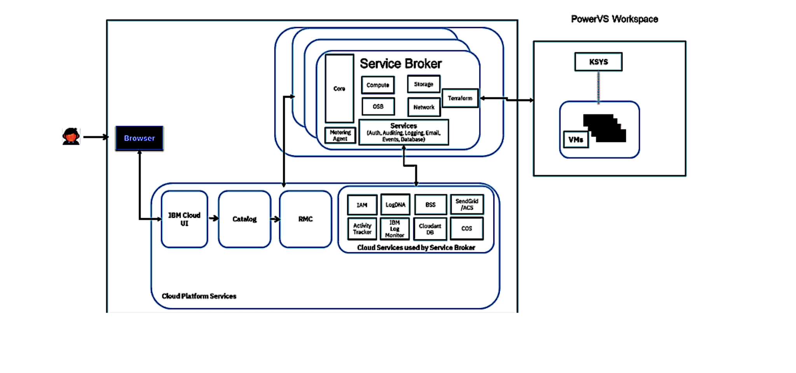

---

copyright:
  years: 2025
lastupdated: "2025-01-23"

keywords: getting started, disaster recovery, PowerVS

subcollection: dr-automation

content-type: tutorial
services: 
account-plan: paid
completion-time: 10m

---

{{site.data.keyword.attribute-definition-list}}

# Getting started with IBM {{site.data.keyword.DR_full_notm}}
{: #getting-started}
{: toc-content-type="tutorial"}
{: toc-services=""}
{: toc-completion-time="10m"}

Set up {{site.data.keyword.DR_full}} to automate disaster recovery (DR) processes for virtualized environments and ensure business continuity with minimal manual intervention. Deploy {{site.data.keyword.DR_short}} from the IBM Cloud Catalog UI, which provides an intuitive interface for selecting and configuring recovery services. The solution automates the recovery of virtual machines (VMs) and workloads, synchronizing data and managing replication between sites to protect critical operations. With robust automation, {{site.data.keyword.DR_short}} minimizes downtime, reduces manual tasks, and enhances business resilience. Leveraging IBM Cloud's global regions, it offers low-latency failover and high availability options to effectively meet your DR requirements.
{: shortdesc}

## Before you begin
{: #prereqs}

Complete the following prerequisites:

1. **IBM Cloud account**: Ensure you have an IBM Cloud account. [Sign up for IBM Cloud](https://cloud.ibm.com/registration) if needed.
2. **IAM setup**: Configure Identity and Access Management (IAM) roles. See [Managing DR Automation (IAM)](/docs/dr-automation-powervs?topic=dr-automation-powervs-iam-manage).
3. **SSH keys**: Generate a public and private SSH key. For details, see [Adding an SSH key](https://cloud.ibm.com/docs/key-management?topic=key-management-get-started).
4. **Plan infrastructure**: Define your DR requirements and estimate costs using the [DR Automation Estimate pricing tool](https://cloud.ibm.com/estimator).

## Configuring IBM {{site.data.keyword.DR_full_notm}}
{: #config-drauto}
{: step}

### Step 1: Set up the orchestrator
{: #setup-orchestrator}

1. Go to the **Manage** tab in your {{site.data.keyword.DR_short}} service instance.
2. Provide the following details:
   - Orchestrator name.
   - IBM Cloud API key.
   - SSH key (upload or select from Secrets Manager).
3. ***Optional***: Adjust advanced settings, such as storage tiers or workspace configurations.
4. For **High Availability (HA)**, configure a standby orchestrator and define a secondary workspace.
5. Click **Deploy orchestrator** to finalize setup.

## Lifecycle of Power Virtual Server DR Automation
{: #lpvsdrauto} 

{: caption="DR Automation life Cycle" caption-side="bottom"}

## Next steps
{: #next-steps}

After completing the initial setup, you can:

- [Manage virtual servers](/docs/dr-automation-powervs?topic=dr-automation-powervs-manage-vm-ser) that enables administrators to monitor and control the virtual server instances.

- [Add sites and configure settings](/docs/dr-automation-powervs?topic=dr-automation-powervs-add-site-ksys) to pair source and target environments for disaster recovery.

These advanced configurations help you optimize your disaster recovery setup for business resilience.
